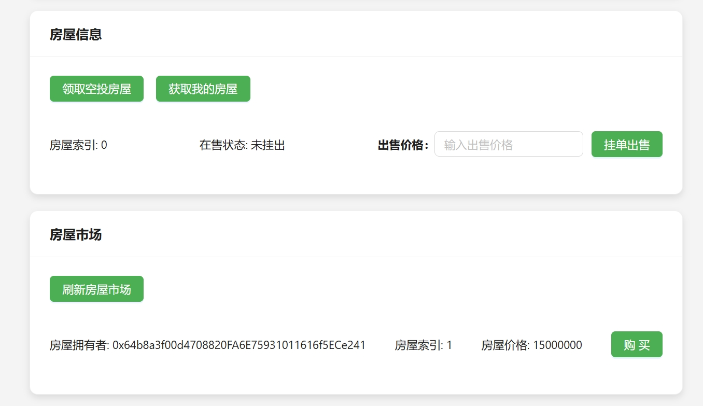

# ZJU-blockchain-course-2024-LXY


## 如何运行

1. 在本地启动Ganache应用，将服务端口改为8545。

2. 在 `./contracts` 中安装需要的依赖，运行如下的命令：
    ```bash
    npm install
    ```
    
3. 在 `./contracts` 中编译合约，运行如下的命令：
    ```bash
    npx hardhat compile
    ```
    
4. 在 `./contracts` 中部署合约，运行如下的命令：

    ```bash
    npx hardhat run .\scripts\deploy.ts --network ganache
    ```

    会得到类似如下结果：

    ```bash
    BuyMyRoom deployed to 0x81ee1358AEe52C545fBc04BC1d594535a19Ca69D
    MyERC20 deployed to 0xcBB83c124C9f552C322d398bAE11f0C9A0D03AA4
    SimpleSwap deployed to 0xa5B77b0D174404735531918ad90142650F279f40
    ```

5. 将4中运行命令得到的地址，替换 `./frontend/src/utils/contracts.ts` 文件中的地址，地址和合约相对应。

6. 网页端Metamask插件新建网络，配置如下：

    

    

7. 网页端Metamask插件导入Ganache中的账户用于测试。

8. 在 `./frontend` 中安装需要的依赖，运行如下的命令：

    ```bash
    npm install
    ```

9. 在 `./frontend` 中启动前端程序，运行如下的命令：
    ```bash
    npm run start
    ```

10. 浏览器输入 `localhost:3000` 来访问前端。

## 功能实现分析

### 后端

#### 1. BuyMyRoom.sol

该合约实现了房屋交易，允许用户领取空投房屋，挂单出售，及购买其他用户的房屋。空投房屋功能通过 `airDrop` 方法实现，为了测试方便，用户可以任意次调用，每次调用都给该用户提供一个新的房屋。用户可以通过 `listHouse` 方法将房屋设定价格并上架出售。购买者可以使用 `buyHouse` 方法以ERC20代币支付价格，扣除手续费后转给卖家，同时转移房屋所有权。此外，合约提供两个查询功能用于前端展示，`getUserHouseList` 返回用户所持房屋列表，`getSellingHouseList` 列出当前在售房屋。 

#### 2. MyERC20.sol

该合约实现了一个ERC20代币“ZJUToken”，并在部署时为合约创建者预铸了100 * 10^15个代币。用户可以通过 `getBalance` 方法查询其持有的ZJUToken余额。 

#### 3. SimpleSwap.sol（Bonus）

该合约利用**恒定乘积自动做市商**机制，实现了一个简单的去中心化交易所，允许用户在以太币和自定义ERC20代币（`MyERC20`）之间进行交换，同时支持添加流动性来获得LP代币，从而能够支持用户使用ERC20代币来购买房屋。合约创建者可以通过 `addLiquidity` 方法向合约提供ETH和ERC20代币，从而获得流动性代币作为回报。合约计算LP代币数量的逻辑分为首次添加和非首次添加两种情况，并根据两种代币的储备比例确定流动性份额。交易功能包括 `swapETHForERC20` 和 `swapERC20ForETH`，分别实现ETH与ERC20代币的互换，使用常数乘积公式计算兑换比率。 

### 前端

#### 1. 连接钱包

- 通过 `connectWallet` 函数，前端应用尝试连接用户的MetaMask钱包。
- 在调用过程中，通过检查 `ethereum` 对象确认 MetaMask 是否正确安装。如果安装完毕，则请求连接账户信息。
- 成功连接后，显示钱包地址，并更新 `account` 状态变量，用户即可在网页端进行链上操作。

#### 2. ETH和ERC20代币兑换

- 通过 `getERC20` 函数支持用户查询 ERC20 代币余额，并显示在前端界面。

- 合约创建者可以通过 `addLiquidity` 函数向流动池添加 ETH 和 ERC20 代币，为市场提供流动性。函数中分别设置 ETH 和 ERC20 代币的注入量，并调用 `approve` 和 `addLiquidity` 合约方法进行流动性注入。

- 通过 `handleEthToErc20` 和 `handleErc20ToEth` 两个函数，支持 ETH 和 ERC20 代币的双向兑换。

- 用户可以通过 `getEthToErc20` 和 `getErc20ToEth` 查询到当前的兑换比例，便于用户在执行兑换前了解预期获得的代币数量。

#### 3. 用户查看房屋列表及挂单

- `handleAirDrop` 函数调用合约的 `airDrop` 方法，使得用户可以点击按钮来获取一个空投房屋。

- `fetchUserHouses` 函数调用合约的 `getUserHouseList` 方法获取用户所拥有的房屋列表，包括房屋状态（是否在售）、价格、房屋索引，并将其保存在 `userHouses` 状态中，便于用户获取自己的房屋列表。

- 用户可以为房屋设定价格，点击挂单按钮，调用 `handleListHouse`  函数将房屋挂单出售。

#### 4. 用户购买房屋

- `fetchMarketHouses` 函数获取市场上在售的房屋列表，包括房屋主人、价格、房屋索引，显示在前端界面供用户选择。

- 用户通过 `handleBuyHouse` 函数购买指定房屋，先对 ERC20 代币进行授权，然后调用 `buyHouse` 方法完成购买操作，成功购买后，刷新市场列表以反映当前在售房屋的状态，确保用户能看到已购买的房屋不再在售。

## 项目运行截图

启动Ganache，目前区块数是204：


启动前端，前端页面如下：


连接合约创建者的钱包：


后端部署三个合约获取地址，并在前端填入：


查看合约创建者的余额，初始给合约创建者提供了10^17份ERC20代币：


合约创建者往流动池中注入ETH和ERC20代币，各5亿，该功能会唤起Metamask：


切换一个普通用户，连接钱包，可以看到地址发生变化，获取余额，该用户初始没有ERC20代币：


该用户使用ETH来兑换ERC20代币，使用5亿的Wei，查询兑换额，根据常数乘积公式计算兑换比率，得到可以兑换的ERC20代币为2.5亿：


点击兑换，在Metamask中确认后，重新获取余额，该用户就获得了对应数额的ERC20代币：


由于恒定乘积自动做市商机制的存在，ERC20代币相对价格变高，再次用5亿Wei尝试兑换，可兑换到的ERC20代币数量变少了：


继续使用该用户，点击两次领取空投房屋，并点击获取我的房屋刷新状态，可以看到房屋列表有两个房屋了：


在房屋索引为0的对应房屋的出售价格处，输入10000000（一千万），点击挂单出售，在Metamask中确认后，房屋状态变为在售，并且挂单按钮变灰，不可再次出售：


以15000000（一千五百万）的价格挂单出售另一个房屋，刷新房屋市场，可以看到两个房屋已经正确在市场上挂单，并具有正确的房主地址和价格：


切换到第三个用户，并兑换足够的代币，用来购买第二个用户挂单的价值10000000（一千万）ERC20代币的房屋（索引为0），点击购买，弹出Metamask界面进行确认：


购买后刷新该用户的房屋列表和房屋市场，发现房屋市场不再有该房屋，同时用户房屋列表出现该房屋：



再次切换到第二个用户，查看余额和所拥有房屋，发现余额增加了9972800，小于房屋价格一千万是因为扣除了挂单的手续费，同时所拥有房屋也不再有索引为0的房屋：


最后查看Ganache，发现因为上述的交易操作，区块数从最初的204变为了现在的217：


以上便是我的去中心化的房屋购买系统的完整演示过程。

## 参考内容

- 助教课程的参考Demo见：[DEMOs](https://github.com/LBruyne/blockchain-course-demos)。

- 快速实现 ERC721 和 ERC20：[模版](https://wizard.openzeppelin.com/#erc20)。

- 如何实现ETH和ERC20的兑换？使用去中心化交易所。[参考讲解](https://www.wtf.academy/en/docs/solidity-103/DEX/)
